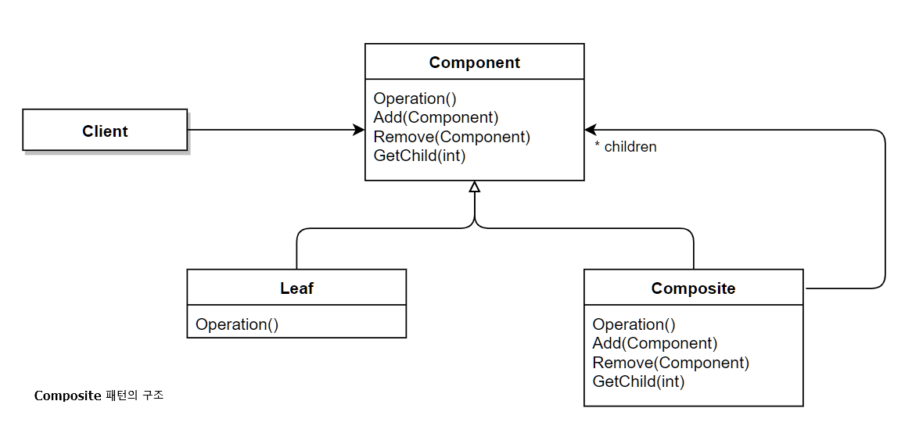
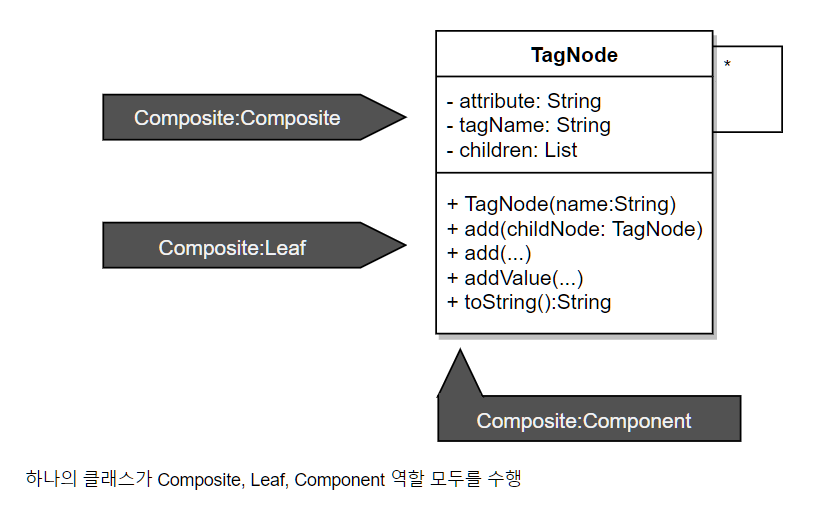
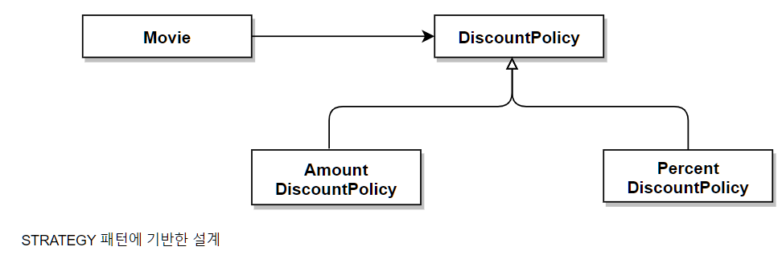

## 15. 디자인 패턴과 프레임워크 

- 디자인 패턴 : 소프트웨어 설계에서 반복적으로 발생하는 문제에 대해 반복적으로 적용할 수 있는 해결 방법
  - 목적 : 설계를 재사용 하는 것. 특정한 변경을 일관성 있게 다룰 수 있는 협력 템플릿을 제공

- 프레임워크 : 애플리케이션의 아키텍처를 구현 코드의 형태로 제공한다
  - 목적 : 설계와 코드를 함께 재사용 하기 위한 것. 특정한 변경을 일관성 있게 다룰 수 있는 확장 가능한 코드 템플릿을 제공
  
- 결론적으로 디자인 패턴과 프레임워크 모두 협력을 일관성 있게 만들기 위한 방법이다. 

### 01 디자인 패턴과 설계 재사용

#### 소프트웨어 패턴

- `패턴이란 무엇인가` 논의에 대한 몇 가지 핵심적인 특징
  - 패턴은 반복적으로 발생하는 문제와 쌍으로 정의된다. 
  - 패턴을 사용함으로써 이미 알려진 문제와 이에 대한 해법을 문서로 정리할 수 있으며, 이 지식을 다른 사람과 의사소통할 수 있다. 
  - 패턴은 추상적인 원칙과 실제 코드 작성 사이의 간극을 메워주며 실질적인 코드 작성을 돕는다. 
  - 패턴의 요점은 패턴이 실무에서 탄생했다는 점이다. 
  
- 패턴은 한 컨텍스트에서 유용한 동시에 다른 컨텍스트에서도 유용한 `아이디어` 다.
  - 최소 세가지의 서로 다른 시스템에 문제 없이 적용할 수 있고 유용한 경우에 패턴으로 간주한다(3의 규칙)

- 패턴은 지식 전달과 커뮤니케이션 수단으로 활용할 수 있기 때문에 `이름` 이 중요한 요소가 된다. 
  
- 패턴은 반복적인 규칙을 발견할 수 있는 모든 영역이 대상이 될 수 있다(조직 구성법, 일정 추정법, 요구사항 관리 방법)
  
- 패턴은 홀로 존재하지 않는다.
  - 특정 패턴 내에 포함된 컴포넌트와 컴포넌트 간의 관계는 더 작은 패턴에 의해 서술될 수 있으며, 패턴들을 포함하는 더 큰 패턴 내에 통합될 수 있다. 
  - 패턴 언어 : 연관된 패턴들의 집합들이 모여 구성한다. 
    -  연관된 패턴 카테고리, 패턴의 생성 규칙과 함께 패턴 언어에 속한 다른 패턴과의 관계 및 협력 규칙을 포함한다. 
  - 패턴 시스템- 현재 패턴 언어와 거의 동일한 의미로 사용

#### 패턴 분류 

- 패턴을 분류하는 가장 일반적인 방법

  - 디자인 패턴 
    -  특정한 설계 문제를 해결하는 것을 목적으로 하며 협력하는 컴포넌트들 사이에서 반복적으로 발생하는 구조를 서술.
    -  중간 규모의 패턴
    -  프로그래밍 언어나 프로그래밍 패러다임에 독립적
    -  상위로 아키텍처 패턴
    -  하위로 이디엄 

  - 아키텍처 패턴
    - 미리 정의된 서브시스템들을 제공 및 책임을 정의하며 관계를 조직화 하는 규칙과 가이드라인을 포함.
    - 구체적인 소프트웨어 아키텍처를 위한 템플릿을 제공
    -  프로그래밍 언어나 프로그래밍 패러다임에 독립적
  
  - 이디엄
    - 특정 프로그래밍 언어에만 국한된 하위 레벨 패턴
    - 주어진 언어의 기능을 사용해 컴포넌트 간의 특정 측면을 구현하는 방법을 서술
    - 언어에 종속적 ex) C++의  COUNT POINTER 

  - 분석 패턴
    - 도메인 내의 개념적인 문제를 해결하는 데 초점
    - 업무 모델링 시에 발견되는 공통적인 구조를 표한하는 개념들의 집합
    - 단 하나의 도메인에 대해서만 적절할 수도 있고 여러 도메인에 걸쳐 적용할 수도 있다. 

#### 패턴과 책임-주도 설계

- 패턴은 반복적으로 발생하는 문제를 해결하기 위해 사용할 수 있는 `공통적인 역할과 책임, 협력`의 훌륭한 예제를 제공한다. 
  - 예) STRATEGY패턴, BRIDGE 패턴, OBSERVER 패턴 등

- 패턴의 구성 요소는 클래스가 아니라 `역할` 이다. 
    - Composite 패턴
      - 패턴의 구성 요소인 Componen, Composite, Leaf는 클래스가 아니라 협력에 참여하는 객체들의 `역할`이다.
      - 역할이 제공하는 오퍼레이션을 구현하는 어떤 객체라도 해당 역할을 수행할 수 있다. 
    
    
      - 반대로 다수의 클래스가 동일한 역할을 구현할 수도 있다. 

    - 디자인 패턴을 따른다고 할 때 역할, 책임, 협력의 관점에서 유사성을 공유하는 것이지 강제하는 것은 아니라는 점을 이해해야 한다. 

#### 캡슐화와 디자인 패턴

- 각 디자인 패턴은 특정한 변경을 캡슐화하기 위한 독자적인 방법을 정의하고 있다. 
- 
- 영화 예매 시스템과 STRATEGY 패턴
     
  - Movie가 DiscountPolicy 상속 계층을 합성 관계로 유지해야 하는 설계는 STRATEGY 패턴을 적용한 예다. 
    - 패턴의 목적은 알고리즘의 변경을 캡슐화 하는 것이고 이를 위해 합성을 이용한다. 

- 영화 예매 시스템과 TEMPLATE METHOD 패턴
  - 변경을 캡슐화하기 위해 상속을 사용
  - 알고리즘 교체와 같은 요구사항이 없다면 상대적으로 STRATEGY 패턴보다 `복잡도`를 낮출 수 있다는 면에서 장점이 있다. 

- 핸드폰 과금 시스템과 DECORATOR 패턴
  - DECORATOR패턴은 객체의 행동을 동적으로 추가할 수 있게 해주는 패턴
  - 객체의 행동을 결합하기 위해 합성을 사용한다. 

- 대부분의 디자인 패턴의 목적은 특정한 변경을 캡슐화함으로써 유연하고 일관성 있는 협력을 설계할 수 있는 경험을 공유하는 것
- 디자인 패턴에서 중요한 것은 어떤 변경을 캡슐화하는지를 이해하는 것, 그리고 어떤 방법을 사용하는지를 이해하는 것이 중요하다. 

#### 패턴은 출발점이다. 

- 출발점이지 목적지가 아니다. 설계의 목표가 돼서는 안된다. 
- 목적에 맞게 패턴을 수정하라 
- 패턴을 익힌 후에는 모든 설계 문제를 패턴으로 해결하려고 시도하기 쉽다 -> 패턴 만능주의 
- 명확한 `트레이드오프` 없이 패턴을 남용하면 설계가 불필요하게 복잡해지게 된다. 
- 패턴을 적용할 때는 항상 설계를 좀 더 단순하고 명확하게 만들 수 있는 방법이 없는지를 고민해야 한다. 
- 효과적으로 적용하는 법
  - 패턴을 지향하거나 패턴을 목표로 리팩터링 하는 것
