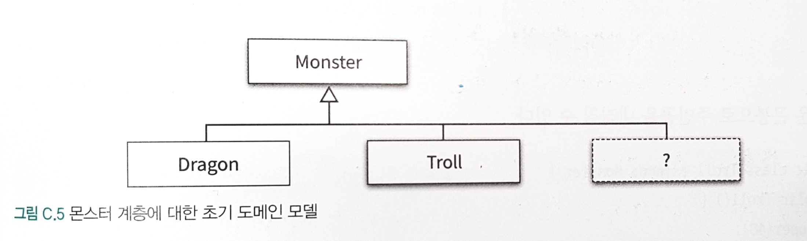

## 동적인 협력, 정적인 코드 

- 객체는 동적이다. 살아 움직이는 존재이다.
- 프로그램은 정적이다. 작성되고 나면 직접 손을 대기 전까지 변하지 않는다. 
   
- 때문에 프로그래머는 두 가지 모델을 동시에 마음속에 그려야 한다.
  - 동적모델 : 프로그램 실행 구조를 표현하는 움직이는 모델
    - 객체와 협력으로 구성
  - 정적모델 : 코드의 구조를 담는 고정된 모델
    - 타입과 관계로 구성, 일반적으로 정적 모델이라고 하면 클래스로 구성된 모델을 의미

> 정적 모델은 동적 모델에 의해 주도돼야 하고 동적 모델이라는 토대 위에 세워져야 한다. 프로그램 코드 안에 담아지는 정적 모델은 객체 사이의 협력에 기반해야 한다. 

- 동적 모델을 기반으로 정적 모델을 구상할 때 중요 고려요소는 변경이다. 설계가 필요한 이유는 변경을 수용할 수 있는 코드를 만들기 위해서
  - 수정이 용이한 코드는 응집도가 높고, 결합도가 낮으면 단순해서 쉽게 이해가능한 코드
  - 유연한 코드란 동일한 코드를 이용해 다양한 컨텍스트에서 동작 가능한 협력을 만들 수 있는 코드 
  - 수정이 용이한 코드와 유연한 코드에 대한 욕구는 중복 코드를 제거하게 만드는 가장 큰 압력.
    - 중복이 많을수록 변경시 여러곳을 수정해야 함
    - 중복이 많을수록 버그 확률이 높아짐
    - 유연한 코드로 나아가다 보면 공통점을 하나의 코드로 모아야 하는 상황에 직면
    - `이런 필요성이 중복을 제거하고 새로운 추상화를 도입하게 한다`

### 01 동적 모델과 정적 모델

#### 행동이 코드를 결정한다. 

- 협력에 참여하는 객체의 행동이 객체의 정적 모델을 결정해야 한다. 
- 행동이 코드의 구조에 영향을 미치는 대표적인 예가 바로 `상속 계층을 구성하는 방식`

- Bird, Penguin 예제
  - Bird, Penguin 사이의 정적 모델을 행동을 제외한 채 구상한다면 날 수 있는 펭귄이 나타나거나 다른 행동을 할 수 있다.
    - 개방-폐쇄 원칙(확장엔 열려있고 수정에는 닫혀있다)을 위반하는 코드가 양산될 수 밖에 없다. 

- 중요한 것은 객체가 외부에 제공하는 행동이다.
  - 정적 모델을 미리 결정하고 객체의 행동을 정적 모델에 맞춰서는 안된다. 동적 모델이 정적 모델을 결정해야 한다. 
  - 만약 정적 모델이 협력에 적합하지 않다면 정적모델을 지속적으로 개선하다. 

#### 변경을 고려하다. 

- 객체가 행동의 측면에서 정적 모델을 고려하더라도 변경을 고려하지 않는다면 유지 보수하기 어려운 코드가 만들어진다. 

- 핸드폰 과금 시스템 예제
  - 상속 계층에 속한 객체들의 행동을 잘 표현하지만 변경이라는 측면에서는 좋은 설계가 아니여서 중복코드가 늘어나고 유연하지 않다.
  - 상속 계층을 합성으로 변경하여 중복 발생을 방지. 

- 동일한 행동을 제공하는 정적 모델이 있다면 항상 현재의 설계에서 요구되는 변경을 부드럽게 수용할 수 있는 설계를 선택하라.

### 02 도메인 모델과 구현

#### 도메인 모델에 관하여

- 도메인 : 사용자가 프로그램을 사용하는 대상 영역
- 모델 : 지식을 선택적으로 단순화하고 의식적으로 구조화한 형태
- 도메인 모델 : 사용자가 프로그램을 사용하는 대상 영역에 대한 지식을 선택적으로 단순화하고 의식적으로 구조화한 형태

- 객체지향 분석 설계에서 제안하는 지침 중 
  - `소프트웨어의 도메인에 대해 고민하고 도메인을 기반으로 소프트웨어를 구축하라`
  - 이 지침을 따르면 개념과 소프트웨서 사이의 표현적 차이를 줄일 수 있다. 
  - > 중요한 것은 도메인 모델을 작성하는 것이 목표가 아니라 출발점 이라는 것
  
> 모델은 옳거나 틀린 것이 아니다. 유용하거나 유용하지 않은 정도의 차이만 있을 뿐이다.

- 도메인 모델은 여러분의 도메인에 대한 지식을 표현하고 코드의 구조의 대한 힌트를 제공할 수 있다면 어떤 형태로 표현하더라도 상관이 없다. 
  
- 중요한 것은 소프트웨어의 기능과 객체의 책임이다. 코드의 구조를 이끄는 것은 객체들의 협력이다.
- 도메인 안의 개념들을 기반으로 출발하되 객체들의 협력이 도메인 모델에 맞지 않다면 필요한 몇가지 개념만 남기고 과감히 수정하라.

- 도메인 개념을 충실히 따르는 코드가 목적이 아니다. 객체들의 협력을 지원하는 코드 구조를 만드는 것이다. 

#### 몬스터 설계하기 

- 주인공 캐릭터를 공격하는 다양한 종류의 몬스터가 등장하는 게임을 설계해야 한다고 해보자.
- 몬스터의 종류는 확장할 수 있어야 한다. 
  

- 새로운 몬스터를 추가해 달라는 요청이 물밀듯이 들어올 때까지는 깔끔했다...
- 필요한 변경은 새로운 몬스터를 쉽게 추가할 수 있어야 한다. 
- 지금도 기존 코드변경없이 새 몬스터를 추가할 수 있기 때문에 개방-패쇄 원칙을 준수하는 좋은 설계라고 할 수 있다. 

- 몬스터 종류별로 서브클래스를 추가하는 대신 품종을 가지도록 설계 개선(Breed class 합성)
- 앞에서 합성을 사용한 핸드폰 요금시스템과는 다르다. 여기서 합성을 이용한 이유는 새로운 클래스를 추가하고 싶지 않기 때문이다. 

- 지금 살펴본 방법은 타입을 구현할 수 있는 또 다른 방법, 인터페이스나 클래스 대신 인스턴스로 구현했다. 

- 이처럼 어떤 인스턴스가 다른 인스턴스의 타입을 표현하는 방법을 `TYPE OBJECT 패턴` 이라고 부른다. Breed 인스턴스가 TYPE OBJECT

#### 행동과 변경을 고려한 도메인 모델

- 초기에 고안한 도메인 모델은 좋은 출발점이 될 수는 있지만 객체의 행동과 변경이라는 요소를 고려하면 빠르게 그 가치가 떨어진다.
- 구현하거나 변경하기 더 쉬운 모델이 떠올랐다면 과감하게 초기 아이디어를 버려라. 

- 그림C.5는 실제 코드와 간극이 발생하고 C.6은 코드의 구조와 일치하기에 C.6이 더 유용한 모델이다.

- 한걸음 더 나아가 JSON 형식으로 서술한다면 데이터까지 표현할 수 있고 전체에 대해 이해하기 더 쉬워진다.

- 도메인 모델은 단순히 클래스 다이어그램이 아니다. 도메인의 핵심을 간략하게 단순화해서 표현할 수 있는 모든 것이 도메인 모델이다. 

- 형식은 중요하지 않다. 중요한 것은 전달하려는 의미다. 

- 또 다른 예로 11장에서 본 `기본 정책과 부가 정책 사이의 관계를 표현한 도메인 모델` 은 분류 체계를 표현한 것이 아니다. 요금을 계산하는 실행 시점의 모습을 표현한 `동적 모델이다`. 

- 이 동적 모델을 가장 잘 표현할 수 있는 구조를 작성하려고 노력했고 그 결과물이 C.4 정적 모델이다. 

- 요점은 도메인 모델은 정적 모델의 형태를 띨 필요가 없으며 구조가 코드와 다를 필요가 없는 것이다. 최종 모습은 객체의 행동과 변경에 기반해야 하며 코드의 구조를 반영해야 한다. 

- 중요한 것은 도메인 모델을 봤을 때 도메인의 개념뿐만 아니라 코드도 함께 이해될 수 있는 구조를 찾는 것이다. 

#### 분석 모델, 설계 모델, 그리고 구현 모델

- 이론적으로 설명한 모델들
  - 분석 모델 : 해결방법에 대한 언급 없이 순수하게 문제 도메인에 초첨을 맞춘 모델
  - 설계 모델 : 분석 모델을 바탕으로 기술 적인 관점에서 솔루션을 서술하는 모델
  - 구현 모델 : 설계 모델을 기반으로 구현 모델을 만들고 프로그래밍 언어를 사용해 컴퓨터가 이해할 수 있는 명령어로 변환한다. 

- 그러나 분석, 설계 구현을 명확하게 구분하는 것은 가능하지도 않을뿐더러 소프트웨어 품질에 악영향을 미친다. 
- 우리가 원하는 것은 분석과 설계와 구현 동안 동일한 모델을 유지하는 것이다. 

- 구현코드가 분석, 설계 모델을 최대한 반영하는 것이 가장 이상적이다. 만약 설계 모델의 일부가 적용 기술 내에서 구현 불가능하다면 설계 모델을 변경해야 한다. 

- 모델링 툴에 저장된 다이어그램이 코드와 상관이 없다면 당장 다이어그램을 파기하고 모델링 툴을 버려라. 

- 분석 모델을 설계 모델로 변환하는 작업이 많은 시간을 소비하고 있다면 설계 모델에 모데인을 반영하도록 수정하고 분석 모델을 폐기처분 하자.

- 결론 : 분석, 설계, 구현 모델이 다르다는 생각을 버려라. 별개의 활동이라는 생각 역시 버려라. 초점은 동일하다. `모든 단계에 걸쳐 행동과 변경에 초점을 맞춰라`
