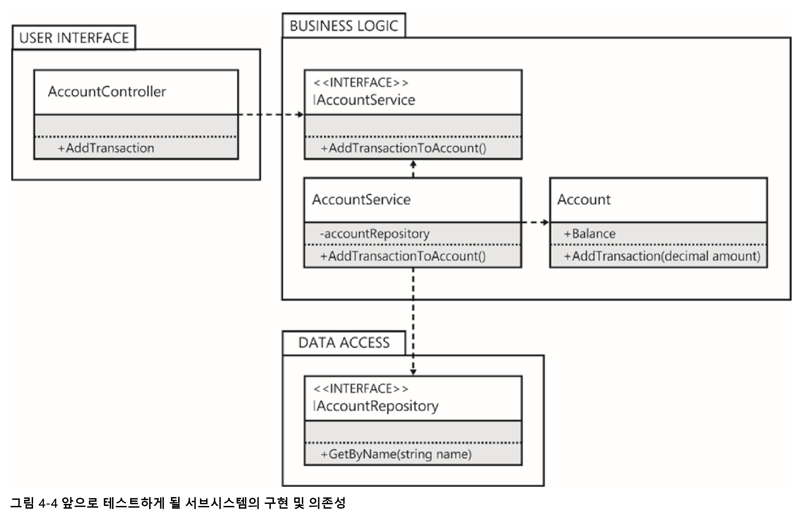
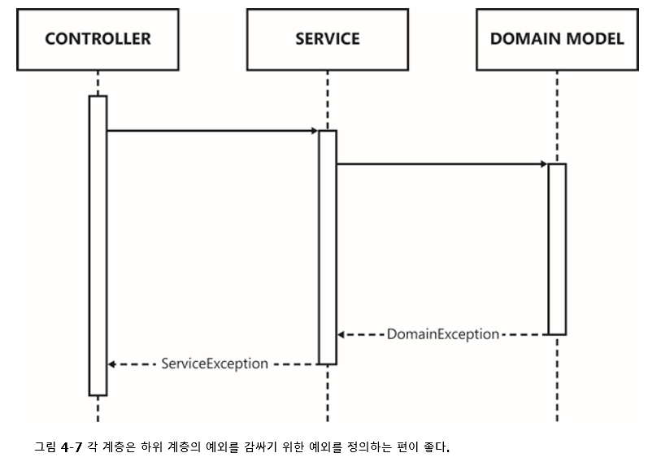
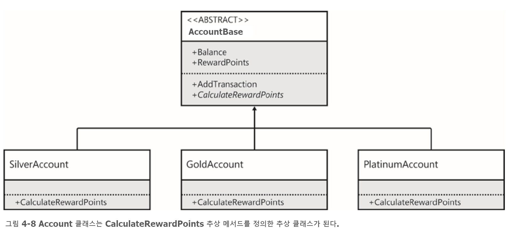

# 4 단위 테스트와 리팩토링

> 이번 장에서 학습할 내용
>  - 단위 테스트와 리팩토링에 대해 알아보고, 이 두가지가 각광받는 이유를 설명한다.
>  - 단위 테스트와 리팩토링이 본질적으로 어떻게 연결되는지 이해한다.
>  - 테스트 우선(test first)방식으로 코드를 작성하고 테스트가 요구하는 사항만을 구현하는데 초점을 맞춘다.
>  - 전체적인 디자인의 향상을 위해 프로덕션 코드를 리팩토링 한다.
>  - 지나치게 정의된 단위 테스트를 식별하고 이를 리팩토링 한다. 


## 단위 테스트 

단위 테스트는 모든 프로그래머에게 필수적인 것으로 인식되어야 한다. 
    - 단위테스트를 제때 작성하지 못하고 나중에 후회하는 것보다는 코드를 배포하고 난 후 적절한 기술 부채를 처리하는 것이 훨씩 낫다.
    - 하지만 프로젝트의 시간 엄수와 완성도 측면에서 어느 정도의 타협점을 가질 수밖에 없다. 

### 준비, 동작, 검증

모든 단위 테스트는 아래의 세가지 부분으로 구성 된다. AAA(Arrange, Act, Assert)패턴이라고 하며 모든 테스트는 다른 사람이 읽을 수 있도록 반드시 이 패턴을 따라야 한다. 
 - 테스트의 사전 조건을 `준비(arrangement)`한다
 - 테스트해야 할 `동작(action)`을 실행한다.
 - 예상되는 동작이 발생했는지를 `검증(assertion)` 한다.

#### ■ 사전 조건 준비하기 

테스트할 시스템(SUT, System Under Test) 준비 

``` c#
[TestClass]
public class AccountTest
{
    [TestMethod]
    public void AddingTransactionChangesBalance()
    {
        // Arrange
        var account = new Account();
    }
}

예제 4-1 SUT를 생성하는 것은 단위 테스트를 준비하기 위한 첫 번째 단계이다 (MSTest)
``` 
- 메서드의 이름은 테스트할 의도(이 계좌에 새로운 거래내역이 추가되면 계좌의 잔금은 이 거래내역에 따라 변경된다)를 간결하게 설명한다. 

#### ■ 테스트할 동작 실행하기

``` c#
[TestClass]
public class AccountTest
{
    [TestMethod]
    public void AddingTransactionChangesBalance()
    {
        // Arrange
        var account = new Account();
        // Act
        account.AddTransaction(200m);
    }
}

예제 4-2 모든 `동작(Act)` 단계에서는 SUT와 단 한 번만 상호작용해야 한다. 
```
 
#### ■ 예상 결과 검증하기

- 모든 단위 테스트에서 가장 중요한 부분
- 예제의 테스트는 `실제값`과 `기대값`의 비교를 통해 가능하다
  - 기대값은 코드에 의해 도출되는 것이 아니라 시간의 흐름에 따라 작성자 스스로가 알고 있어야 한다. 
  
``` c#
[TestClass]
public class AccountTest
{
    [TestMethod]
    public void AddingTransactionChangesBalance()
    {
        // Arrange
        var account = new Account();
        // Act
        account.AddTransaction(200m);
        // Assert
        Assert.AreEqual(200m, account.Balance);
    }
}
```
#### ■ 테스트 실행하기

- 단위테스트는 실행 파일이 아닌 어셈블리를 생성하는 테스트 프로젝트에 작성한다
- 따라서 테스트 프로젝트는 스스로 실행 될 수 없기 때문에 단위테스트 실행기가 필요하다. 
- 앞의 예제의 테스트의 검증은 실패한다 
  - 아직 Account 클래스를 구현 하지 않았음


### 테스트 주도 개발

- 테스트 주도개발(TDD) 환경에서는 오히려 단위테스트를 작성하기 전에 테스트 대상이 되는 시스템을 먼저 구현하지 `않는 것`을 선호한다.
- TDD 방법론을 도입한다는 것은 단위 테스트를 먼저 작성한 다음에 프로덕션 코드를 작성한다는 것을 의미한다.

#### ■ 빨강, 초록, 리팩토링!

- 빨강, 초록, 리팩토링 이라고 불리는 세 단계
  1. SUT의 예상 동작을 대상으로 우선 실패하는 테스트 코드를 작성한다. => 테스트 실행기의 결과 `빨강!`
  2. SUT에 당장 필요한 코드만을 구현하여 기존에 성공한 테스트에 영향을 미치지 않고도 새로 구현한 테스트가 성공하도록 한다.  => 테스트 실행기 결과 `초록!`
     - 가장 간단한 코드로 구현하는 이유는 개발자의 직감에 의해 코드에 대한 검증을 계속해서 도출해 내기 위함.
  3. `만일` SUT의 디자인이나 전체적인 품질을 향상시키기 위해 리팩토링이 필요하다면 이제 시작하면 된다 => `리팩토링!`
     - 지금까지 작성한 코드가 테스트에 명시된 예상 동작을 정말 올바른 방법으로 구현한 것인지 평가해 봐야 한다.
     - 또 다른 예상 동작에 대한 단위 테스트를 추가함으로써 현재 구현이 올바르지 않다는 것을 증명 할 수 있다. 
     - 새로운 테스트를 추가 하고 과정을 반복하여 올바른 해결책을 구현해 넣는다. 
  
- 중요한 점은 요구사항이 변경되어 새로운 기능이 추가되면 클래스가 수행해야 하는 일을 테스트 코드로 정의하여 이미 작성해 둔 단위 테스트들을 지원해야 한다는 점이다. 
  - 그렇지 않으면 `사이드 이펙트`를 유발하는 코드를 작성하는 실수를 쉽게 범하게 된다. 


### 보다 복잡한 테스트 

#### ■ 명세



- 계속해서 작성할 테스트는 비즈니스 계층의 다른 부분, 즉 서비스에 대한 테스트를 위한 것이다. 
- 우리가 작성할 서비스는 프레임워크에 관계 없이 재사용이 가능해야 한다. 
  - 프레임워크들에 대한 의존성을 전혀 갖지 않으며, Account 클래스에 대해서만 간접적으로 의존하게 된다는 것을 의미

- 다이어그램 패키지는 어셈블리에 직접 대응하는 것이 아니라 애플리케이션의 논리 계층을 표현하고 있다. 

#### ■ 테스트 디자인 하기

- 준비 : 테스트 하고자 하는 SUT, 즉 AccountService 객체의 인스터스 생성한다.
- 동작 : AddTransactionToAccount 메서드를 호출한다.
- 검증 : SUT가 Account 객체 인스턴스의 AddTransaction 메서드를 호출하고 올바른 금액을 인수로 전달한다. 
  - 이 단계에서는 특정 객체의 메서드가 호출되고 적절한 값이 전달되었는지를 검증해야 하기에 모의객체(mocking objects)가 필요하다. 
  
#### ■ 모의 객체로 테스트 작성하기

- AccountService 객체는 IAccountRepository 를 이용하여 Account 객체를 얻기 때문에 Account 객체를 직접 전달 할 수 없다. 
- 때문에 IAccountRepository를 구현하는 모의 객체를 작성하여 전달한다. 
- AccountService의 단위 테스트를 완성하기 위한 준비 조건
  - 검증할 Account 객체를 생성한다.
  - 서비스 객체의 생성자에 전달할 IAccountRepository의 인스턴스를 생성한다.
  
- 조건을 갖추면 예제 4-15와 같이 검증 코드를 작성할 수 있다.
    ``` c#
    [TestClass] 
    public class AccountServiceTests 
    {
        [TestMethod]
        public void AddingTransactionToAccountDelegatesToAccountInstance()
        { 
            // Arrange
            var account = new Account();
            var fakeRepository = new FakeAccountRepository(account);
            var sut = new AccountService(fakeRepository); 
            
            // Act
            sut.AddTransactionToAccount("Trading Account", 200m); 

            // Assert
            Assert.AreEqual(200m, account.Balance);
        }
    }

    예제 4-15 서비스 메서드가 아직 구현되어 있지 않기 때문에 테스트는 실패하게 된다. 
    ```

#### ■ 모의 객체를 이용한 테스트 

- 조금만 생각해 보면 모의 객체를 직접 작성하는 것이 제법 힘든 노동이라는 점을 쉽게 알 수 있다. 
- IAccountRepository 의 포믜객체는 외부 모의 객체 프레임워크를 사용해서 생성할 수도 있다. 

  ``` c#
  [TestMethod]
  public void AddingTransactionToAccountDelegatesToAccountInstance() 
  {     
      // Arrange     
      var account = new Account();     
      var mockRepository = new Mock<IAccountRepository>();     
      mockRepository.Setup(r => r.GetByName("Trading Account")).Returns(account);     
      var sut = new AccountService(mockRepository.Object); 
  
      // Act     
      sut.AddTransactionToAccount("Trading Account", 200m); 
  
      // Assert     
      Assert.AreEqual(200m, account.Balance); 
    }
  
  예제 4-17 Moq와 같은 모의 객체 프레임워크를 이용하면 모의 객체를 손쉽게 생성할 수 있다.
  ``` 

  - 직접 작성했던 모의객체와는 달리 Mock.object는 IAccountRepository의 인스턴스가 아니다. 
    - CLR은 제네릭 매개변수로부터의 상속을 지원하지 않는다. 
    - 대신 프록시 인스턴스 사이의 결합 관계가 생성되고 모의 객체화된 인터페이스에 접근할 수 있게 된다.
  
  - 느슨한 모의객체 
    - 모든 리턴 값은 default 키워드에 의한 기본값으로 정의된다. 
    - Moq가 느슨한 모의객체에 해당
    - 
  - 엄격한 모의객체
    - 미리 정의하지 않은 속성에 접근하거나 메서드를 호출하면 예외가 발생한다. 

# 4 단위 테스트와 리팩토링

> 이번 장에서 학습할 내용
>  - 단위 테스트와 리팩토링에 대해 알아보고, 이 두가지가 각광받는 이유를 설명한다.
>  - 단위 테스트와 리팩토링이 본질적으로 어떻게 연결되는지 이해한다.
>  - 테스트 우선(test first)방식으로 코드를 작성하고 테스트가 요구하는 사항만을 구현하는데 초점을 맞춘다.
>  - 전체적인 디자인의 향상을 위해 프로덕션 코드를 리팩토링 한다.
>  - 지나치게 정의된 단위 테스트를 식별하고 이를 리팩토링 한다. 


## 단위 테스트 

단위 테스트는 모든 프로그래머에게 필수적인 것으로 인식되어야 한다. 
    - 단위테스트를 제때 작성하지 못하고 나중에 후회하는 것보다는 코드를 배포하고 난 후 적절한 기술 부채를 처리하는 것이 훨씩 낫다.
    - 하지만 프로젝트의 시간 엄수와 완성도 측면에서 어느 정도의 타협점을 가질 수밖에 없다. 

### 준비, 동작, 검증

모든 단위 테스트는 아래의 세가지 부분으로 구성 된다. AAA(Arrange, Act, Assert)패턴이라고 하며 모든 테스트는 다른 사람이 읽을 수 있도록 반드시 이 패턴을 따라야 한다. 
 - 테스트의 사전 조건을 `준비(arrangement)`한다
 - 테스트해야 할 `동작(action)`을 실행한다.
 - 예상되는 동작이 발생했는지를 `검증(assertion)` 한다.

#### ■ 사전 조건 준비하기 

테스트할 시스템(SUT, System Under Test) 준비 

``` c#
[TestClass]
public class AccountTest
{
    [TestMethod]
    public void AddingTransactionChangesBalance()
    {
        // Arrange
        var account = new Account();
    }
}

예제 4-1 SUT를 생성하는 것은 단위 테스트를 준비하기 위한 첫 번째 단계이다 (MSTest)
``` 
- 메서드의 이름은 테스트할 의도(이 계좌에 새로운 거래내역이 추가되면 계좌의 잔금은 이 거래내역에 따라 변경된다)를 간결하게 설명한다. 

#### ■ 테스트할 동작 실행하기

``` c#
[TestClass]
public class AccountTest
{
    [TestMethod]
    public void AddingTransactionChangesBalance()
    {
        // Arrange
        var account = new Account();
        // Act
        account.AddTransaction(200m);
    }
}

예제 4-2 모든 `동작(Act)` 단계에서는 SUT와 단 한 번만 상호작용해야 한다. 
```
 
#### ■ 예상 결과 검증하기

- 모든 단위 테스트에서 가장 중요한 부분
- 예제의 테스트는 `실제값`과 `기대값`의 비교를 통해 가능하다
  - 기대값은 코드에 의해 도출되는 것이 아니라 시간의 흐름에 따라 작성자 스스로가 알고 있어야 한다. 
  
``` c#
[TestClass]
public class AccountTest
{
    [TestMethod]
    public void AddingTransactionChangesBalance()
    {
        // Arrange
        var account = new Account();
        // Act
        account.AddTransaction(200m);
        // Assert
        Assert.AreEqual(200m, account.Balance);
    }
}
```
#### ■ 테스트 실행하기

- 단위테스트는 실행 파일이 아닌 어셈블리를 생성하는 테스트 프로젝트에 작성한다
- 따라서 테스트 프로젝트는 스스로 실행 될 수 없기 때문에 단위테스트 실행기가 필요하다. 
- 앞의 예제의 테스트의 검증은 실패한다 
  - 아직 Account 클래스를 구현 하지 않았음


### 테스트 주도 개발

- 테스트 주도개발(TDD) 환경에서는 오히려 단위테스트를 작성하기 전에 테스트 대상이 되는 시스템을 먼저 구현하지 `않는 것`을 선호한다.
- TDD 방법론을 도입한다는 것은 단위 테스트를 먼저 작성한 다음에 프로덕션 코드를 작성한다는 것을 의미한다.

#### ■ 빨강, 초록, 리팩토링!

- 빨강, 초록, 리팩토링 이라고 불리는 세 단계
  1. SUT의 예상 동작을 대상으로 우선 실패하는 테스트 코드를 작성한다. => 테스트 실행기의 결과 `빨강!`
  2. SUT에 당장 필요한 코드만을 구현하여 기존에 성공한 테스트에 영향을 미치지 않고도 새로 구현한 테스트가 성공하도록 한다.  => 테스트 실행기 결과 `초록!`
     - 가장 간단한 코드로 구현하는 이유는 개발자의 직감에 의해 코드에 대한 검증을 계속해서 도출해 내기 위함.
  3. `만일` SUT의 디자인이나 전체적인 품질을 향상시키기 위해 리팩토링이 필요하다면 이제 시작하면 된다 => `리팩토링!`
     - 지금까지 작성한 코드가 테스트에 명시된 예상 동작을 정말 올바른 방법으로 구현한 것인지 평가해 봐야 한다.
     - 또 다른 예상 동작에 대한 단위 테스트를 추가함으로써 현재 구현이 올바르지 않다는 것을 증명 할 수 있다. 
     - 새로운 테스트를 추가 하고 과정을 반복하여 올바른 해결책을 구현해 넣는다. 
  
- 중요한 점은 요구사항이 변경되어 새로운 기능이 추가되면 클래스가 수행해야 하는 일을 테스트 코드로 정의하여 이미 작성해 둔 단위 테스트들을 지원해야 한다는 점이다. 
  - 그렇지 않으면 `사이드 이펙트`를 유발하는 코드를 작성하는 실수를 쉽게 범하게 된다. 


### 보다 복잡한 테스트 

#### ■ 명세


- 계속해서 작성할 테스트는 비즈니스 계층의 다른 부분, 즉 서비스에 대한 테스트를 위한 것이다. 
- 우리가 작성할 서비스는 프레임워크에 관계 없이 재사용이 가능해야 한다. 
  - 프레임워크들에 대한 의존성을 전혀 갖지 않으며, Account 클래스에 대해서만 간접적으로 의존하게 된다는 것을 의미

- 다이어그램 패키지는 어셈블리에 직접 대응하는 것이 아니라 애플리케이션의 논리 계층을 표현하고 있다. 

#### ■ 테스트 디자인 하기

- 준비 : 테스트 하고자 하는 SUT, 즉 AccountService 객체의 인스터스 생성한다.
- 동작 : AddTransactionToAccount 메서드를 호출한다.
- 검증 : SUT가 Account 객체 인스턴스의 AddTransaction 메서드를 호출하고 올바른 금액을 인수로 전달한다. 
  - 이 단계에서는 특정 객체의 메서드가 호출되고 적절한 값이 전달되었는지를 검증해야 하기에 모의객체(mocking objects)가 필요하다. 
  
#### ■ 모의 객체로 테스트 작성하기

- AccountService 객체는 IAccountRepository 를 이용하여 Account 객체를 얻기 때문에 Account 객체를 직접 전달 할 수 없다. 
- 때문에 IAccountRepository를 구현하는 모의 객체를 작성하여 전달한다. 
- AccountService의 단위 테스트를 완성하기 위한 준비 조건
  - 검증할 Account 객체를 생성한다.
  - 서비스 객체의 생성자에 전달할 IAccountRepository의 인스턴스를 생성한다.
  
- 조건을 갖추면 예제 4-15와 같이 검증 코드를 작성할 수 있다.
    ``` c#
    [TestClass] 
    public class AccountServiceTests 
    {
        [TestMethod]
        public void AddingTransactionToAccountDelegatesToAccountInstance()
        { 
            // Arrange
            var account = new Account();
            var fakeRepository = new FakeAccountRepository(account);
            var sut = new AccountService(fakeRepository); 
            
            // Act
            sut.AddTransactionToAccount("Trading Account", 200m); 

            // Assert
            Assert.AreEqual(200m, account.Balance);
        }
    }

    예제 4-15 서비스 메서드가 아직 구현되어 있지 않기 때문에 테스트는 실패하게 된다. 
    ```

    ``` c#
    public class AccountService : IAccountService 
    {    
        public AccountService(IAccountRepository repository)     
        {         
            this.repository = repository;    
        } 
 
        public void AddTransactionToAccount(string uniqueAccountName, decimal transactionAmount)
        {         
            var account = repository.GetByName(uniqueAccountName);         
            account.AddTransaction(transactionAmount);     
        } 
 
        private readonly IAccountRepository repository; 
    }

    예제 4-16 테스트에 성공하기 위해 구현한 AccountService 클래스
    ```

#### ■ 모의 객체를 이용한 테스트 

- 조금만 생각해 보면 모의 객체를 직접 작성하는 것이 제법 힘든 노동이라는 점을 쉽게 알 수 있다. 
- IAccountRepository 의 포믜객체는 외부 모의 객체 프레임워크를 사용해서 생성할 수도 있다. 

  ``` c#
  [TestMethod]
  public void AddingTransactionToAccountDelegatesToAccountInstance() 
  {     
      // Arrange     
      var account = new Account();     
      var mockRepository = new Mock<IAccountRepository>();     
      mockRepository.Setup(r => r.GetByName("Trading Account")).Returns(account);     
      var sut = new AccountService(mockRepository.Object); 
  
      // Act     
      sut.AddTransactionToAccount("Trading Account", 200m); 
  
      // Assert     
      Assert.AreEqual(200m, account.Balance); 
    }
  
  예제 4-17 Moq와 같은 모의 객체 프레임워크를 이용하면 모의 객체를 손쉽게 생성할 수 있다.
  ``` 

- 직접 작성했던 모의객체와는 달리 Mock.object는 IAccountRepository의 인스턴스가 아니다. 
  - CLR은 제네릭 매개변수로부터의 상속을 지원하지 않는다. 
  - 대신 프록시 인스턴스 사이의 결합 관계가 생성되고 모의 객체화된 인터페이스에 접근할 수 있게 된다.

- 느슨한 모의객체 
  - 모든 리턴 값은 default 키워드에 의한 기본값으로 정의된다. 
  - Moq가 느슨한 모의객체에 해당
  - 
- 엄격한 모의객체
  - 미리 정의하지 않은 속성에 접근하거나 메서드를 호출하면 예외가 발생한다. 

- Moq 프레임워크는 메서드 호출에 대해 다음과 같은 기대값을 적용할 수 있다.
  - 다른 람다 식 호출
  - 특정 값 리턴
  - 지정된 타입의 예외 발생
  - 메서드가 호출되었는지 여부 확인

- 단위 테스트를 작성하는 데 있어서 잘몬된 상태의 테스트가 성공하는 상활을 피하는 것은 매우 중요하다. 

#### ■ 추가 테스트

- TDD 접근법을 바탕으로 AccountService 객체를 구현하였지만 이 메서드의 동작에는 잠재적인 문제들이 있다. 
- 이 메서드의 동작에 대한 확신을 줄 수 있는 추가적인 테스트들이 필요하다
  > - 계좌 저장소 객체가 null을 참조하고 있으면 어떻게 될까?
  > - 저장소가 계좌를 찾지 못하면 어떻게 될까?
  > - 계좌의 메서드가 예외를 발생하면 어떻게 될까?
- 이런 추가적인 테스트를 작성함으로써 구현에 문제가 없다는 확신을 얻을 수 있게 된다. 

- 계좌 저장소가 null을 참조하는 상황이라면?

  ``` c#
  [TestMethod] 
  [ExpectedException(typeof(ArgumentNullException))] 
  public void CannotCreateAccountServiceWithNullAccountRepository() 
  {
      // Arrange     
  
      // Act
      new AccountService(null); 
  
      // Assert 
  }

  예제 4-18 준비 과정도 검증 과정도 없지만 예외 상황을 테스트하는 유요한 패턴이다. 
  ```
  - ExpectedException 를 이용해 IAccountService에 null 참조가 전달되면 ArgumentNullException 예외가 발생한다는 것을 명시하고 있다.
  - 이 테스트가 성공하려면 `전제조건`을 구현해야 한다. 
  ``` c#
  public AccountService(IAccountRepository repository) 
  {
      if (repository == null)
          throw new ArgumentNullException("repository", "A valid account    repository must be supplied."); 

      this.repository = repository;
  }

  예제 4-19 생성자에 null 참조를 전달하면 예외가 발생한다. 
  ```

- 저장소가 계좌를 찾지 못하면?
  - 널 객체 패턴을 구현하지 않았다. 
  ``` c#
  [TestMethod]
  public void DoNotThrowWhenAccountIsNotFound() 
  {
      // Arrange
      var mockRepository = new Mock<IAccountRepository>();
      var sut = new AccountService(mockRepository.Object); 
 
      // Act
      sut.AddTransactionToAccount("Trading Account", 100m); 
 
      // Assert 
  }

  예제 4-20 기대하는 예외를 위한 특성도 없고 검증 코드도 없다. 
  ```
  - 테스트의 준비 과정에서 모의 저장소 객체를 생성하여 아무런 기대 사항을 명시하지 않았기에 null 값이 리턴되고(느슨한 모의객체) 테스트는 NullReferenceException 가 발생되고 테스트는 실패한다
  
  ``` c# 
  public void AddTransactionToAccount(string uniqueAccountName, decimal transactionAmount)
  {     
      var account = repository.GetByName(uniqueAccountName);     
      if (account != null)     
      {         
          account.AddTransaction(transactionAmount);     
      } 
  }

  예제 4-21 if 구문을 이용해 NullReferenceException 예외가 발생하지 않도록 한다. 
  ```

- Account 의 메서드(AddTransaction)가 예외를 발생하면 어떻게 될까?
  - 계층간 의존성 누수를 방지하기 위해 하위 계층에서 발생하는 예외를 상위 계층에서 새로운 예외로 감싸는(wrap) 것이 좋다. 
  
  - 여기에서 중요한 것은 InnerException속성을 통해 하위 예외에 접근할 수 있는 방법을 제공한다는 점이다. 

``` c#
[TestMethod]
[ExpectedException(typeof(ServiceException))]
public void AccountExceptionsAreWrappedInThrowServiceException()
{
    // Arrange   
    var account = new Mock<Account>();
    account.Setup(a => a.AddTransaction(100m)).Throws<DomainException>();
    var mockRepository = new Mock<IAccountRepository>();
    mockRepository.Setup(r => r.GetByName("Trading Account")).Returns(account.Object);
    var sut = new AccountService(mockRepository.Object);

    // Act   
    sut.AddTransactionToAccount("Trading Account", 100m);

    // Assert 
}

예제 4-22 호출 시 예외를 발생시키는 모의 계좌 객체
``` 

``` c#
public void AddTransactionToAccount(string uniqueAccountName, decimal transactionAmount)
{
    var account = repository.GetByName(uniqueAccountName);
    if (account != null)
    {
        try
        {
            account.AddTransaction(transactionAmount);
        }
        catch (DomainException)
        {
            hrow new ServiceException();
        }
    }
}

예제 4-23 예외의 타입을 변경하기 위해 try/catch 구문을 사용한다. 
```

#### ■ 결함을 수정하기 위한 테스트 작성하기 

- 현재 예제 코드와 관련되어 다음과 같은 결함 보고를 받았다고 가정해 보자.
  - `계좌에 거래 내역을 추가할 때 ServiceException 예외가 발생하고 있습니다.`
  - 의도된 동작이나 원래는 SeviceException이 DomainException 정보와 와 원인을 감싸야 하는데, 단위 테스트에서 이부분에 대한 검증을 놓쳤기에 원인을 알기가 어렵게 되었다. 
- 결함이 발견되면 가장먼저 두 가지를 확인하는 단위 테스트를 작성한다. 
  1. 결함이 발생할 수 있는 상황을 정확하게 재현하기 위한 과정
  2. 현재 정확히 동작하지 않는 기대 동작을 테스트 하기 위한 코드 

  ``` c# 
  [TestMethod]
  public void AccountExceptionsAreWrappedInThrowServiceException()
  {
      // Arrange  
      var account = new Mock<Account>();
      account.Setup(a => a.AddTransaction(100m)).Throws<DomainException>();
      var mockRepository = new Mock<IAccountRepository>();
      mockRepository.Setup(r => r.GetByName("Trading Account")).Returns(account.Object);
      var sut = new AccountService(mockRepository.Object);

      // Act    
      try
      {
          sut.AddTransactionToAccount("Trading Account", 100m);
      }
      catch (ServiceException serviceException)
      {
          // Assert    
          Assert.IsInstanceOfType(serviceException.InnerException, typeof(DomainException));
      }
  }
  
  예제 4-24 이제는 발생한 예외를 직접 검증해야 한다. 
  ```
  - ExpectedException 특성은 이제 이 테스트에 적합하지 않다. 직접 확인해야 하기 때문.

  ``` c#
  public void AddTransactionToAccount(string uniqueAccountName, decimal transactionAmount)
  {
      var account = repository.GetByName(uniqueAccountName);
      if (account != null)
      {
          try
          {
              account.AddTransaction(transactionAmount);
          }
          catch (DomainException domainException)
          {
              throw new ServiceException("도메인 모델에서 예외가 발생했습니다.", domainException);
          }
      }
  }

  예제 4-25 원례 예외를 감싼 새로운 예외를 발생한다. 
  ```

#### ■ 테스트 설정하기
 
- MSTest 프레임워크 역시 테스트 클래스에서 작성된 각 테스트를 실행하기에 앞서 먼저 호출할 초기화 메서드를 정희할 수 있는 기능을 제공한다 
  - [TestInitialize]
  - `가독성이 향상된다.`

---------------------

## 리펙토링

리펙토링은 기존 코드의 디자인을 향상시키기 위한 과정이다. 즉 단위 테스트를 작성한 이후에 수행하는 작업이다.

### 기존 코드 수정하기

- 리팩토링 대상은 Account 클래스 
- CalculateRewardPoints 메서드 추가
- 고객 보상 점수 수집기능

  ``` c# 
  public class Account
  {
      public Account(AccountType type)
      {
          this.type = type;
      }

      public decimal Balance
      {
          get; private set;
      }

      public int RewardPoints
      {
          get; private set;
      }

      public void AddTransaction(decimal amount)
      {
          RewardPoints += CalculateRewardPoints(amount);
          Balance += amount;
      }

      public int CalculateRewardPoints(decimal amount)
      {
          int points;
          switch (type)
          {
              case AccountType.Silver:
                  points = (int)decimal.Floor(amount / 10);
                  break;
              case AccountType.Gold:
                  points = (int)decimal.Floor((Balance / 10000 * 5) + (amount / 5));
                  break;
              case AccountType.Platinum:
                  points = (int)decimal.Ceiling((Balance / 10000 * 10) + (amount / 2));
                  break;
              default:
                  points = 0;
                  break;
          }
          return Math.Max(points, 0);
      }

      private readonly AccountType type;
  }

  예제 4-28 계좌의 잔액과 더불어 보상 점수를 추적하는 새로운 클래스
  ```
  - 이 클래스의 가장 중요한 변경 사항
    - 새로운 속성을 이용해 이 계좌에 연결된 고객의 보상 점수를 관리한다. 
    - 각 계좌는 실버, 골드, 플래티넘 등 세 가지 종류로 분류된다. 
    - 거래 내역이 계좌에 추가될 때마다 고객이 보상 점수를 모으게 된다. 
    - 보상 점수는 여러 가지 요건에 의해 결정되며, 이를 계산하는 메서드가 추가되었다. 
      - 계좌 종류 - 높은 등급일수록 더 많은 점수를 얻게 된다.
      - 거래 금액 - 고객이 더 많은 소비를 할수록 더 많은 보상 점수를 얻게 된다.
      - 계좌의 현재 잔액 - 골드 및 플래티넘 고객은 잔액이 높을수록 더 많은 보상 점수를 얻게 된다. 

  - 이 코드의 단위 테스트가 작성되어 있다면, 리팩토링 과정이 원래 동작에 아무런 영향을 미치지 않았음을 확인할 수 있으므로 큰 도움이 된다.
  - 리팩토링은 코드의 `결과`가 아닌 `순서`를 정리하는 과정이다. 
  

#### ■ '매직 넘버' 를 상수로 변경하기

> 매직넘버 : 코드에 하드코딩 숫자 값들을 의미한다. 주로 이 값들의 변경은 코드의 실행 결과에 반영된다. 

- 하드코딩된 숫자들이 무엇을 의미하는지 명확히 하기 위해 변수로 변경한다.
  - 코드를 작성한 사람도 시간이 지나면 의미를 기억해 내기 쉽기 않다. 
  - 코드를 처음보는 사람도 쉽게 이해할 수 있다. 
  - 변수 명이 길어지는 것을 걱정하지 말고 그 자체로 문서화 될 수 있는 코드를 작성하기를 권한다. 

#### ■ 다형성을 이용하여 조건식 교체하기

- CalculateRewardPoints 메서드의 switch문은 두가지 문제를 가지고 있다.
  -  가독성에 악 영향을 미친다
  -  유지보수가 어렵다.
     -  새 등급 추가시 마다 Account 클래스를 수정해야 한다. 테스트 코드도 추가.
  
- 코드를 수정하지 않고 확장할 수 있도록 수정
  
  ``` c#
  예제 4-31 Account 클래스에서 복잡도를 제거하자

  public abstract class AccountBase
  {
      public decimal Balance
      {
          get;
          private set;
      }

      public int RewardPoints
      {
          get;
          private set;
      }

      public void AddTransaction(decimal amount)
      {
          RewardPoints += CalculateRewardPoints(amount);
          Balance += amount;
      }

      public abstract int CalculateRewardPoints(decimal amount);
  }
  ```

  - AccountBase의 서브클래스를 생성하고 CalculateRewardPoints 메서드를 구현함으로써 새로운 종류의 계좌를 손쉽게 추가할 수 있게 되었다. 

#### ■ 생성자를 팩토리 메서드로 교체하기

- AccountBase에 AccountType 열거자를 재사용하여 새로운 팩토리 메서드 추가 
``` c#
예 4-33 보다 간소화된 switch 구문을 사용하는 팩토리 메서드

public abstract class AccountBase
{
    public static AccountBase CreateAccount(AccountType type)
    {
        AccountBase account = null; switch (type)
        {
            case AccountType.Silver:
                account = new SilverAccount();
                break;
            case AccountType.Gold:
                account = new GoldAccount();
                break;
            case AccountType.Platinum:
                account = new PlatinumAccount();
                break;
        }
        return account;
    }
}
```
- 팩토리 메서드의 클라이언트 고통을 덜어주는 두가지 특징
  - static 메서드 : 클라이언트는 타입의 인스턴스가 아닌 타입 자체를 이용해 메서드를 호출할 수 있다. 
  - 리턴하는 타입이 기반타입 이라는 것 : 클라이언트로 부터 계좌의 서브타입들을 숨길 수 있다. (internal 사용하면 코드스멜 예방)

- 팩토리 메서드를 사용하는 방법이 최선은 아니다. 더 나은 방법은 CreateAccount 메서드를 적절한 인터페이스로 정의 하는 것.

#### ■ 생성자를 팩토리 클래스로 대체하기 

- 팩토리 클래스는 팩토리 메서드 외의 또 다른 대안이다. 
- 클라이언트를 독립적으로 동작하는 팩토리와 굳이 결합할 필요가 없다. 

```c#
예제 4-35 팩토리 클래스를 이용하면 객체 생성에 대한 상세 내용을 숨길 수 있다. 

public interface IAccountFactory 
{     
    AccountBase CreateAccount(AccountType accountType); 
}
```
- 메서드의 인터페이스는 이 메서드가 인스턴스 메서드라는 점만을 제외하면 팩토리 메서드에 정의했던 것과 완전히 동일하다.
  
``` c#
예제 4-36 서비스는 생성자 매개변수를 통해 팩토리를 전달받아 계좌를 생성할 때 사용한다. 
public class AccountService
{
    public AccountService(IAccountFactory accountFactory, IAccountRepository accountRepository)
    {
        this.accountFactory = accountFactory;
        this.accountRepository = accountRepository;
    }

    public void CreateAccount(AccountType accountType)
    {
        var newAccount = accountFactory.CreateAccount(accountType);
        accountRepository.NewAccount(newAccount);
    }

    private readonly IAccountRepository accountRepository;
    private readonly IAccountFactory accountFactory;
}
``` 

### 새로운 계좌 종류

- 현재의 모델이 `기술 부채(technical dept)`라는 형태로 드러나는 잘못된 예측을 바탕으로 만들어졌다는 것을 깨닫게 될 수도 있다. 

#### ■ 새로운 보상 계좌

- 고객이 다른 종류의 계좌(브론즈 계좌)를 추가하고 싶어한다고 가정하자
- 새로운 계좌 지원을 위해 `도메인 계층`에 적용해야 할 변경 사항은 두 가지이다.
  1. AccountBase를 상속하는 새로운 서브클래스 정의
  2. 팩토리 클래스나 팩토리 메서드가 새로 정의된 계좌 종류를 지원하도록 수정, 열거자에도 타입 추가

- 수정하지 않아도 되도록 이 메서드를 조금 더 리팩토링할 수 있는 방법은 없을까?
  - AccountType 에 정의된 각각의 값들과 그에 해당하는 서브클래스에 직접 접근하지 않고 AccountType 의 이름만으로 AccountBase 클래스를 생설할 수 없을까?
  ``` c#  
  예제 4-39 계좌가 특정한 명명 규칙을 준수한다면 팩토리는 충분히 모든 종류의 서브클래스를 처리할 수 있다. 

  public AccountBase CreateAccount(string accountType)
  {
      var objectHandle = Activator.CreateInstance(null, string.Format("{0}Account", accountType));
      return (AccountBase)objectHandle.Unwrap();
  }
  ```
  - AccountType가 문자열 값을 사용하면 향후 문제가 될 소지가 있다. 연습을 통해 극복할 수 있기는 하다.
  - 그럼에도 이런 형태의 리팩토링은 조금 위험 하다고 할 수 있다. 
    - 팩토리의 추상화에 대한 유출을 만들 위험이 있기 때문이다.
    - 그로 인해 요구되는 모든 시나리오에 대해 완벽하게 동작하지 않을 수도 있다.
    - 코드를 수정하기 전에는 아래와 같은 제약이 발생한다.
      >- 모든 계좌 종류는 반드시 [Type]Account라는 명명 규칙을 따라야 한다. [Type]접두어는 열거자의 값이다.
      >- 모든 계좌 종류는 팩토리 메서드와 동일한 어셈블리에 정의되어야 한다. 
      >- 모든 계좌 종류는 public 기본 생성자를 정의해야 한다. 즉, 어떤 값이든 생성자에 매겨변수를 사용할 수 없다. 
    - 이런 제약이 발생한다는 것은 리팩토링을 너무 과하게 수행한 결과이며 나중에 문제를 유발할 수 있다. 

#### ■ 코드 스멜: 거부된 유산

- 보상 점수를 모을 수 없는 StandardAccount를 추가해야 한다. 두가지 방법이 있다.
  1. AccountBase의 서브클래스를 생성 CalculateRewardPoints 메서드가 0을 리턴하도록 재정의 한다.
  2. 모든 계좌가 보상 점수를 필요로 하지 않는 다는 점을 고려하는 방법
     - 실질적으로 두 개의 서로 다른 종류의 도메인 모델을 정의 하는 셈
     - 서브클래스가 부모클래스로 부터 상속받는 것을 효과적으로 거부해야 한다. 그렇기 때문에 `거부된 유산` 이란 이름이 붙게 됨

#### ■ 위임을 이용해 상속 대체하기

- AccountBase 클래스를 두 부분으로 분리해야 한다.
  - 보상 카드를 표현하기 위해 새로운 클래스 계층으로 분리
  - 보상 카드에 대한 처리를 위임하여 계좌 클래스 상속을 대체 한다. 

``` c# 
예제 4-41 보상 점수 및 그에 대한 계산을 Account 클래스로부터 분리한다. 

public interface IRewardCard
{
    int RewardPoints { get; }

    void CalculateRewardPoints(decimal transactionAmount, decimal accountBalance);
}
```
- 이에 따라 CalculateRewardPoints 메서드의 인터페이스에도 두 가지 변화가 발생했다
  1. RewardPoints를 직접 변경하기에 리턴값이 필요 없다.
  2. 메서드 내에서 계좌의 잔액을 매개변수로 받게 됐다. 
     - 보상 카드 객체가 직접 캡슐화하지 못하는 정보들을 모두 매개변수 형태로 전달되어야 한다.
     - 향후에 인터페이스가 다시 변경될 가능성도 없지는 않다. 

``` C#
예제 4-42 보상 카드 구현 예제

internal class BronzeRewardCard : IRewardCard
{
  //IRewardCard 구현
}
```
``` C#
예제 4-43 각 계좌는 보상 카드를 보유할 수 있다. 
public class Account
{
    public Account(IRewardCard rewardCard)
    {
        this.rewardCard = rewardCard;
    }

    public decimal Balance
    {
        get; private set;
    }

    public void AddTransaction(decimal amount)
    {
        rewardCard.CalculateRewardPoints(amount, Balance); Balance += amount;
    }

    private readonly IRewardCard rewardCard;
}
```

- Account 클래스는 더이상 추상 클래스가 아니고 IRewardCard 인스턴스를 매개변수로 전달 받는다. 
  - 계좌에 거래 내역이 발생하게 되면 그에 대한 처리는 해당 인스턴스에게 위임한다
- 표준 계좌(보상 없는)를 모델링 하려면 생성자에 보상카드에 대한 참조에 null이나(추가 null값 처리필요) NullRewardCard를 구현한다. 

-------------------

## 마치며

- 단위 테스트와 리팩토링은 항상 쌍을 이루고 있어서 뗄레야 뗄 수 없는 관계이다. 
- 객체가 실세계의 개념을 내포하고 있는 만큼 `단위테스트`는 객체의 실제 동작을 기술한 것이여야 한다. 
- 프로덕션 코드는 `기대사항을 충족하는 단위 테스트를 작성하는 과정`에서 얻어지는 부수적인 결과물이다. 
- 단위 테스트를 작성한다는 것은 계속해서 발생하게 될 요구 사항들을 수렴할 수 있는 적응형 코드 기반을 마련한다는 의미가 있다. 
- 애자일 기초부분 끝! - 다음장부턴 SOLID 코드란 무엇이며 코드의 적응성을 어떻게 향상시킬 수 있는지 살펴보자!

