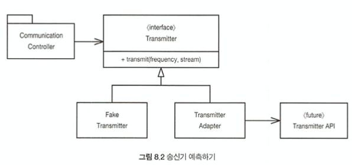

# 경계
- 시스템에 들어가는 모든 소프트웨어를 직접 개발하는 경우는 드물다
- 때로는 패키지, 오픈 소스, 다른팀이 제공하는 컴포넌트 등을 사용하게 된다
- 어떤 식으로든 이 `외부 코드를 우리 코드에 깔끔하게 통합`해야 한다. 
- 이 장에서는 경계를 깔끔하게 처리하는 `기법과 기교`를 살펴본다

## 외부 코드 사용하기 
- 인터페이스 제공자와 사용자 사이에는 특유의 긴장이 존재한다.
    - 패키지 제공자나 프레임워크 제공자는 적용성을 최대한 넓히려 한다 
        - 더 많은 환경에서 돌아가야 구매자가 많아지니까~
    - 사용자는 자신의 요구에 집중하는 인터페이스를 바란다. 
- 이런 제공자와 사용자 사이에 긴장으로 인해 시스템 경계에서 문제가 생길 소지가 많다. 
    ``` java
     예) Java의 map
        
        clear() void – Map
        containsKey(Object key) boolean – Map
        containsValue(Object value) boolean – Map
        clear() void – Map
        containsKey(Object key) boolean – Map
        containsValue(Object value) boolean – Map
        entrySet() Set – Map
        equals(Object o) boolean – Map
        get(Object key) Object – Map
        getClass() Class<? extends Object> – Object
        hashCode() int – Map
        isEmpty() boolean – Map
        keySet() Set – Map
        notify() void – Object
        notifyAll() void – Object
        put(Object key, Object value) Object – Map
        putAll(Map t) void – Map
        remove(Object key) Object – Map\
        size() int – Map
        toString() String – Object
        values() Collection – Map
        wait() void – Object
        wait(long timeout) void – Object
        wait(long timeout, int nanos) void – Object
    ```
    - 다양한 인테페이스로 많은 기능 제공
    - 기능성과 유연성은 확실하지만 `위험`도 크다
        - 누구나 clear 가능 
        - 객체 유형 제한 없음 
        - 필요하지 않은 기능까지 제공
        - Map 인스턴스가 변할 경우 수정할 코드 많아짐 
            - 실제로 자바5가 제네릭이 추가 되며 변경된 사례가 있음
         
    - `캡슐화`가 하나의 방법이 될 수 있다.(래핑?)
        - Map을 사용하는 다른 클래스를 정의하여 `필요한 기능만 노출`
        

         ``` java
            public class Sensors{
                private Map sensors = new HashMap();

                public Sensor getById(String id) {
                    return (Sensor) sensors.get(id);
                }
            //이하 생략
            }
            
            - 경계의 인터페이스(이 경우에는 Map의 메서드)는 숨겨진다.
            - Map의 인터페이스가 변경되더라도 여파를 최소화할 수 있다. 
                - Sensor클래스를 사용하는 측에서는 신경쓸 필요가 없다
            - 이는 또한 사용자의 목적에 딱 맞게 디자인되어 있으므로 이해하기 쉽고 잘못 사용하기 어렵게 된다.
         ```
         - 무조건 캡슐화 하라는 의미는 아니다
         -  Map과 같은 경계 인터페이스를 이용할 때는 이를 이용하는 클래스나 클래스 계열 밖으로 노출되지 않도록 주의한다. 
         - Map 인스턴스를 공개 API의 인수로 넘기거나 반환값으로 사용하지 않는다. 
        
## 경계 살피고 익히기
- 외부 코드를 사용하면 적은 시간에 더 많은 기능을 출시하기 쉬워진다
    - 외부 패키지 테스트가 우리 책임은 아니나 우리 자신을 위해 우리가 사용할 코드를 테스트하는 편이 바람직
    - 대게는 하루나 이틀 문서를 읽으면 사용법을 결정. 동작을 확인하다. 
    - 때로는 우리 버그인지 라이브러리 버그인지 찾아내느라 오랜 디버깅으로 골치를 앓는다. 
- 외부 코드는 익히기 어렵다. 통합도 어렵다
    - 곧바로 우리쪽 코드를 작성하는 대신 먼저 간단한 테스트 케이스를 작성해 외부 코드를 익힌다면?
    - 짐뉴커는 이를 `학습테스트` 라 부튼다
        - 단위테스트를 이용하여 프로그램에서 사용하려는 방식대로 외부 API를 호출한다.
        - 통제된 환경에서 API를 제대로 이해하는지를 확인하는셈
        - API를 사용하려는 목적에 초점을 맞춘다

## log4j 익히기
- 
    ``` java
        // 1.
        // 우선 log4j 패키지를 내려 받아 소개 페이지를 연다
        // 문서를 자세히 읽기 전에 첫 번째 테스트 케이스를 작성한다. 화면에 Hello를 출력하는 테스트케이스
        @Test
        public void testLogCreate() {
            Logger logger = Logger.getLogger("MyLogger");
            logger.info("hello");
        }

        // 2.
        // 위 테스트는 "Appender라는게 필요하다"는 오류가 발생
        // 문서를 더 읽어보니 ConsoleAppender라는게 있다.
        // 그래서 ConsoleAppender라는 객체를 만들어 다시 돌린다.
        @Test
        public void testLogAddAppender() {
            Logger logger = Logger.getLogger("MyLogger");
            ConsoleAppender appender = new ConsoleAppender();
            logger.addAppender(appender);
            logger.info("hello");
        }

        // 3.
        // 이번에는 "Appender에 출력 스트림이 없다"고 한다.
        // 이상하다. 출력 스트림이 있어야 정상이 아닌가?
        // 구글의 도움을 빌려, 다음과 같이 시도한다.
        @Test
        public void testLogAddAppender() {
            Logger logger = Logger.getLogger("MyLogger");
            logger.removeAllAppenders();
            logger.addAppender(new ConsoleAppender(
                new PatternLayout("%p %t %m%n"),
                ConsoleAppender.SYSTEM_OUT));
            logger.info("hello");
        }
    ```

    - 성공했다. 하지만 ConsoleAppender 에게 콘솔에 쓰라고 알려야 하다니 뭔가 수상하다
    - ConsoleAppender.SYSTEM_OUT 인수를 제거했더니 문제 없다.
    - 하지만 PatternLayout을 제거하니 또 출력 스트림이 없다는 오류가 뜬다
    - 문서를 자세히 보니 "ConsoleAppender의 기본 생성자는 설정되지 않은 상태란다.
    - 당연하지도 유용하지도 않다. log4j 버그이거나 적어도 일관성 부족으로 여겨진다. 

- 조금 더 구글링, 문서 읽기, 테스트를 거쳐 log4j의 동작법을 알아냈고 그것을 간단한 단위 테스트 케이스 몇 개로 표현했다. 
    ``` java
    public class LogTest {
        private Logger logger;
        
        @Before
        public void initialize() {
            logger = Logger.getLogger("logger");
            logger.removeAllAppenders();
            Logger.getRootLogger().removeAllAppenders();
        }
        
        @Test
        public void basicLogger() {
            BasicConfigurator.configure();
            logger.info("basicLogger");
        }
        
        @Test
        public void addAppenderWithStream() {
            logger.addAppender(new ConsoleAppender(
                new PatternLayout("%p %t %m%n"),
                ConsoleAppender.SYSTEM_OUT));
            logger.info("addAppenderWithStream");
        }
        
        @Test
        public void addAppenderWithoutStream() {
            logger.addAppender(new ConsoleAppender(
                new PatternLayout("%p %t %m%n")));
            logger.info("addAppenderWithoutStream");
        }
    }

    ```
    - 간단한 콘솔 로거 초기화 방법을 익혔으니 독자적인 로거 클래스로 캡슐화 한다.
    - 그러면 나머지 log4j 경계 인터페이스를 몰라도 된다. 

## 학습 테스트는 공짜 이상이다. 
- 학습 테스트에 드는 `비용은 없다`.(어차피 쓸 비용이라는 듯)
    - 어짜피 API를 배워야 하므로 오히려 필요한 지식만 확보하는 손쉬운 방법이다. 
- 패키지의 새 버전이 나온다면 학습 테스트를 돌려 차이가 있는지 확인한다. 
    - 패키지가 새로 나올 때마다 새로운 위험이 생기고 호환되지 않으면 학습테스트가 이 사실을 곧바로 밝혀낸다. 
- 학습이 필요하든 그렇지 않든, 실제 코드와 동일한 방식으로 인터페이스 사용하는 테스트 케이스가 필요하다
- 이런 경계 테스트가 있다면 패키지의 새 버전으로 이전하기 쉬워진다. 
    - 그렇지 않다면 낡은 버전을 필요 이상으로 오랫동안 사용하려는 유혹에 빠지기 쉽다. 

## 아직 존재하지 않는 코드를 사용하기
- 경계와 관련해 또 다른 유형은 아는 코드와 모르는 코드를 분리하는 경계다.
    - 때로는 우리 지식이 경계를 넘어 미치지 못하는 코드 영역도 있다. 알려고 해도 알 수가 없다. 더이상 내다보지 않기로 결정한다. 
- 무선 통신 시스템에 들어갈 소프트웨어 개발에 참여한 썰~
    - 송신기(Transmitter)라는 하위 시스템이 있는데 이것의 지식이 거의 없었다
    - 송신기 시스템 책임자들은 인터페이스도 정의하지 못한상태
    - 프로젝트 지연되면 안되니 송신기와 아주 먼 부분부터 작업 진행
    - 대략 `지정한 주파수를 이용해 이 스트림에서 들어오는 자료를 아날로그 신호로 전송하라.` 라는 추상적인 방향성만 갖고 작업을 진행
    - 저쪽 팀이 아직도 API를 설계하지 않아 우리쪽 코드를 진행하고자 자체적으로 인터페이스를 정의
        - 인터페이스는 주파수와 자료 스트림을 입력으로 받았다. 즉 우리가 바라는 인터페이스
    - 
    - 우리가 바라는 인터페이스를 구현하면 우리가 인터페이스를 전적으로 통제한다는 장점이 생긴다. 
    - 가독성도 높아지고 코드 의도도 분명해진다.
    - Transmitter라는 클래스를 만든 후 transmit이라는 메서드를 추가했다.
        - Transmit 인터페이스는 원하는 방식으로 받았다. 송신시 API에서 CommuicationController를 분리 했다.
    - 송신기 팀이 API를 정의한 후에는 TransmitterAdapter를 구현해 간극을 메운다.
        - Adapter 패턴으로 변경사항에 대한 수정할 코드를 한 곳에 모은다.
    - 테스트도 편하다. FakeTransmitter 클래스를 사용하면 CommunicationsController 클래스를 테스트 할 수 있다.
        - Transmitter API 인터페이스가 나온 다음 경계 테스트 케이스를 생성해 우리가 API를 올바로 사용하는지 테스트할 수 있다.

## 깨끗한 경계
- 경계에서는 흥미로운 일이 많이 벌어진다. 변경이 대표적인 예다. 
- 경계에 위치하는 코드는 깔끔히 분리한다.
- 또한 기대치를 정의하는 테스트 케이스도 작성한다.
    - 이쪽 코드에서 외부 패키지를 세세하게 알아야 할 필요가 없다
    - 통제가 불가능한 외부 패키지 대신 통제가 가능한 우리코드에 의존하는 편이 훨씬 좋다. 
- 외부 패키지를 호출하는 코드를 가능한 줄여 경계를 관리하자. 
    - 새로운 클래스로 경계를 감싸거나
    - Adapter 패턴을 사용해 우리가 원하는 인터페이스를 패키지가 제공하는 인터페이스 변환하자. 
    - 어느 방법이든 코드 가독성이 높아지며 일관성도 좋고 외부 패키지가 변했을 때 변경할 코드도 줄어든다 